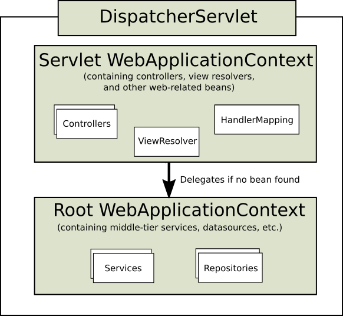

与许多其他Web框架一样，Spring MVC围绕前端控制器模式设计，其中中央Servlet DispatcherServlet为请求处理提供共享算法，而实际工作由可配置委托组件执行。 该模型非常灵活，支持多种工作流程。

DispatcherServlet与任何Servlet一样，需要使用Java配置或web.xml根据Servlet规范进行声明和映射。 反过来，DispatcherServlet使用Spring配置来发现请求映射，视图解析，异常处理等所需的委托组件。

以下Java配置示例注册并初始化DispatcherServlet，它由Servlet容器自动检测（请参阅[Servlet配置](https://docs.spring.io/spring/docs/current/spring-framework-reference/web.html#mvc-container-config)）：

```JAVA
public class MyWebApplicationInitializer implements WebApplicationInitializer {

    @Override
    public void onStartup(ServletContext servletCxt) {

        // Load Spring web application configuration
        AnnotationConfigWebApplicationContext ac = new AnnotationConfigWebApplicationContext();
        ac.register(AppConfig.class);
        ac.refresh();

        // Create and register the DispatcherServlet
        DispatcherServlet servlet = new DispatcherServlet(ac);
        ServletRegistration.Dynamic registration = servletCxt.addServlet("app", servlet);
        registration.setLoadOnStartup(1);
        registration.addMapping("/app/*");
    }
}
```

> 除了直接使用ServletContext API之外，您还可以扩展AbstractAnnotationConfigDispatcherServletInitializer并覆盖特定方法（请参阅Context Hierarchy下的[示例](https://docs.spring.io/spring/docs/current/spring-framework-reference/web.html#mvc-servlet-context-hierarchy)）。

以下web.xml配置示例注册并初始化DispatcherServlet：

```XML
<web-app>

    <listener>
        <listener-class>org.springframework.web.context.ContextLoaderListener</listener-class>
    </listener>

    <context-param>
        <param-name>contextConfigLocation</param-name>
        <param-value>/WEB-INF/app-context.xml</param-value>
    </context-param>

    <servlet>
        <servlet-name>app</servlet-name>
        <servlet-class>org.springframework.web.servlet.DispatcherServlet</servlet-class>
        <init-param>
            <param-name>contextConfigLocation</param-name>
            <param-value></param-value>
        </init-param>
        <load-on-startup>1</load-on-startup>
    </servlet>

    <servlet-mapping>
        <servlet-name>app</servlet-name>
        <url-pattern>/app/*</url-pattern>
    </servlet-mapping>

</web-app>
```

> Spring Boot遵循不同的初始化顺序。 Spring Boot使用Spring配置来引导自身和嵌入式Servlet容器，而不是挂钩到Servlet容器的生命周期。 在Spring配置中检测Filter和Servlet声明，并在Servlet容器中注册。 有关更多详细信息，请参阅[Spring Boot文档](https://docs.spring.io/spring-boot/docs/current/reference/htmlsingle/#boot-features-embedded-container)。

## 1. Context Hierarchy

DispatcherServlet需要一个WebApplicationContext（普通ApplicationContext的扩展）来进行自己的配置。 WebApplicationContext有一个指向ServletContext的链接以及与之关联的Servlet。 它还绑定到ServletContext，以便应用程序可以在RequestContextUtils上使用静态方法，以便在需要访问WebApplicationContext时查找它。

对于许多应用程序，只有一个WebApplicationContext很简单且足够。 也可以有一个上下文层次结构，其中一个根WebApplicationContext在多个DispatcherServlet（或其他Servlet）实例之间共享，每个实例都有自己的子WebApplicationContext配置。 有关上下文层次结构功能的更多信息，请参阅[ApplicationContext的其他功能](https://docs.spring.io/spring/docs/current/spring-framework-reference/core.html#context-introduction)。

根WebApplicationContext通常包含基础结构bean，例如需要跨多个Servlet实例共享的数据存储库和业务服务。 这些bean是有效继承的，可以在特定于Servlet的子WebApplicationContext中重写（即重新声明），它通常包含给定Servlet本地的bean。 下图显示了这种关系：



以下示例配置WebApplicationContext层次结构：

```JAVA
public class MyWebAppInitializer extends AbstractAnnotationConfigDispatcherServletInitializer {

    @Override
    protected Class<?>[] getRootConfigClasses() {
        return new Class<?>[] { RootConfig.class };
    }

    @Override
    protected Class<?>[] getServletConfigClasses() {
        return new Class<?>[] { App1Config.class };
    }

    @Override
    protected String[] getServletMappings() {
        return new String[] { "/app1/*" };
    }
}
```

> 如果不需要应用程序上下文层次结构，则应用程序可以通过getRootConfigClasses()返回所有配置，并从getServletConfigClasses()返回null。

以下示例显示了等效的web.xml：

```XML
<web-app>

    <listener>
        <listener-class>org.springframework.web.context.ContextLoaderListener</listener-class>
    </listener>

    <context-param>
        <param-name>contextConfigLocation</param-name>
        <param-value>/WEB-INF/root-context.xml</param-value>
    </context-param>

    <servlet>
        <servlet-name>app1</servlet-name>
        <servlet-class>org.springframework.web.servlet.DispatcherServlet</servlet-class>
        <init-param>
            <param-name>contextConfigLocation</param-name>
            <param-value>/WEB-INF/app1-context.xml</param-value>
        </init-param>
        <load-on-startup>1</load-on-startup>
    </servlet>

    <servlet-mapping>
        <servlet-name>app1</servlet-name>
        <url-pattern>/app1/*</url-pattern>
    </servlet-mapping>

</web-app>
```

> 如果不需要应用程序上下文层次结构，则应用程序可以仅配置“根”上下文，并将contextConfigLocation Servlet参数保留为空。

## 2. Special Bean Types

## 3. Web MVC Config

## 4. Servlet Config

## 5. Processing

## 6. Interception

## 7. Exceptions

## 8. View Resolution

## 9. Locale

## 10. Themes

## 11. Multipart Resolver

## 12. Logging


